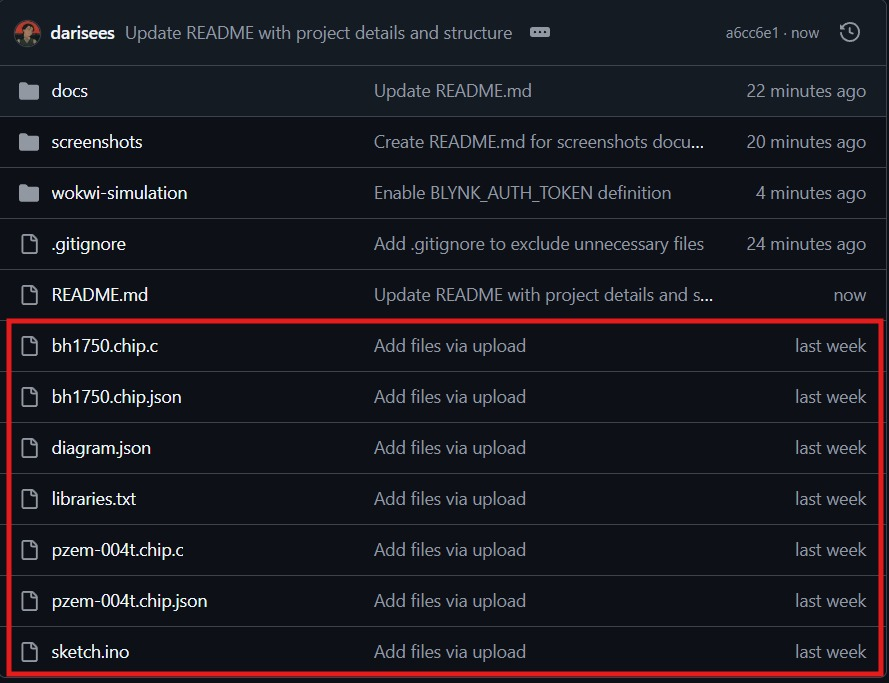

# Legacy Original Files

This folder contains the original Wokwi simulation files that were previously uploaded to the repository before the project structure was reorganized.

These files are kept as a historical archive to preserve the development record of the BRECO Wokwi simulation. The newer and maintained version of the simulation can be found in the `wokwi-simulation/` folder.

## Purpose

The purpose of this folder is to document the original uploaded files before repository cleanup and restructuring.

## Visual Proof

The screenshot below shows the original Wokwi files that were previously located in the root directory before being moved into this legacy archive.

## Archived Files

* `sketch.ino` - Original ESP32 firmware file
* `diagram.json` - Original Wokwi circuit diagram
* `libraries.txt` - Original Wokwi library list
* `bh1750.chip.c` - Original BH1750 custom chip source file
* `bh1750.chip.json` - Original BH1750 custom chip configuration file
* `pzem-004t.chip.c` - Original PZEM-004T custom chip source file
* `pzem-004t.chip.json` - Original PZEM-004T custom chip configuration file

## Notes

* These files may not follow the final repository folder structure.
* The maintained simulation files are located in `wokwi-simulation/`.
* This folder is kept only as a historical reference.
* Future updates should be made in the `wokwi-simulation/` folder, not in this legacy archive.
